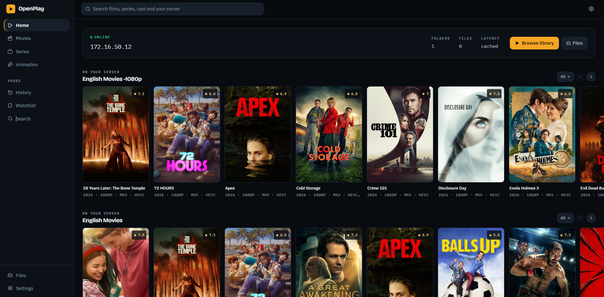
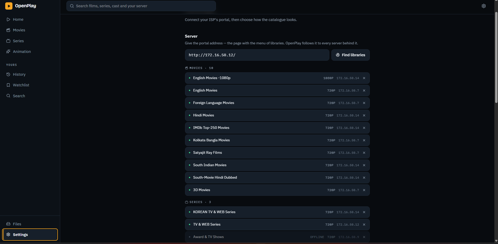

<div align="center">


# OpenPlay

**Turn your ISP's file server into a proper streaming library.**

[**Live preview →**](https://muhit-1.github.io/OpenPlay/)
*(static UI only — GitHub Pages can't run the backend, and the app is a client for* ***your own*** *local server anyway)*

[Features](#features) · [Screenshots](#screenshots) · [Built with](#built-with) · [Getting started](#getting-started) · [Limitations](#known-limitations)

</div>

---

## What is this?

Many ISPs — particularly in South Asia — run a media server on their local
network and publish it over plain HTTP. It is fast, unmetered, and enormous.

It also looks like this:

```
Mercy (2026) 1080p AMZN-WEB x265 HEVC ESub [Dual Audio][Hindi 5.1+English 5.1] -MsMod.mkv
28 Years Later-The Bone Temple (2026) 1080p AMZN [Dual Audio]/
(2025) 1080p/
TV Series ♦  M — R/
```

A wall of directory listings and release names, spread across half a dozen
machines, with no posters, no search, and no way to tell what anything is.

**OpenPlay is a front end for that server.** Give it one address and it finds
every library your ISP hosts, reads each directory, works out what each release
actually is, and pulls posters, ratings, cast and summaries from TMDB. Then it
plays the file straight from the server — nothing is re-hosted, and video never
passes through OpenPlay's backend.

The design principle is that it does not pretend the filesystem isn't there — it
typesets it. Every title carries a small status line saying whether that exact
file is on your server, what it is (`1080P · MKV · HEVC`), and whether your
browser can actually decode it.

> This is a client for a server **you** already have access to. OpenPlay hosts
> and distributes nothing. See the [legal notice](#legal-notice).

---

## Screenshots

**Home — your server's newest titles, with live status**



**Settings — one portal address, every library found automatically**



---

## Features

### One address, every server

Your ISP's portal page links out to libraries scattered across several machines.
Paste that one address and OpenPlay follows it to all of them, groups what it
finds into **Movies / Series / Animation**, and drops the games and software.
It also checks which of those servers are actually answering and marks the rest
offline, rather than failing later when you click.

### It understands release names

The heart of the app is a parser that turns

```
Mercy (2026) 1080p AMZN-WEB x265 HEVC ESub [Dual Audio][Hindi 5.1+English 5.1] -MsMod.mkv
```

into structured data — title, year, season/episode, resolution, source, codec,
bit depth, audio format — so it can find the right TMDB entry. Results are then
*ranked* on title match, year agreement and popularity instead of taking the
first hit, which is how you avoid a same-named documentary showing up in place
of the film you wanted.

It also works out how each library is organised — year buckets, suffixed years
(`(2025) 1080p`), alphabetical buckets, or flat — instead of assuming one layout.

### Search that covers both

One box searches TMDB **and** your server. Search a title to see whether it
exists and whether you have it; search an actor to open their channel; search a
filename to find the file.

### Channels

Every actor, director and studio is a channel listing everything they worked on —
so Amazon MGM Studios has its films, and Tom Holland has his.

### Honest playback

Whether a file will play is decided by **probing the actual file**, not guessing
from its name. Plenty of players slap a scary "x265 — use VLC" warning on
anything with `x265` in the filename; most modern browsers play HEVC in Matroska
perfectly well, so that warning is usually wrong and only trains you to ignore
it. OpenPlay warns only when playback will really fail.

When the browser genuinely can't cope — an unsupported codec, an audio track it
can't switch to, subtitles baked into the file — there is a **Play in VLC**
button that hands the stream straight over.

### The rest

- Custom player: hover-preview scrubber, skip, speed, volume, fullscreen, keyboard shortcuts
- Watch progress and resume, plus History and a Watchlist
- Raw directory browser, for when you want to see the filesystem as it is
- Eight accent colours, three poster sizes, nine metadata languages

---

## Built with

| | |
|---|---|
| **Framework** | [React 19](https://react.dev) + [Vite 8](https://vitejs.dev) |
| **Routing** | React Router v7 |
| **Styling** | [Tailwind CSS v4](https://tailwindcss.com), with a hand-built token system |
| **Icons** | [Lucide](https://lucide.dev) |
| **Type** | Bricolage Grotesque (display), IBM Plex Sans (body), IBM Plex Mono (data) |
| **Metadata** | [TMDB API](https://www.themoviedb.org) |
| **Accounts & sync** | [Firebase](https://firebase.google.com) — anonymous auth + Firestore |
| **Backend** | Vercel serverless functions (`/api`), Express for local dev |

Three small serverless functions do all the server-side work:

| Endpoint | Job |
|---|---|
| `api/proxy.js` | Fetches a listing or subtitle file past CORS. Host allowlist, size cap, SRT→WebVTT conversion. |
| `api/parse.js` | Turns directory HTML (h5ai, Apache, nginx, lighttpd) into JSON. |
| `api/tmdb.js` | TMDB gateway — ranked search, detail, trending, genres, people, studios. Keeps the API key server-side. |

---

## Getting started

### Prerequisites

- Node.js 20 or newer
- A free [TMDB API key](https://www.themoviedb.org/settings/api)
- A Firebase project, if you want watch history and the watchlist
- Access to an ISP media server (OpenPlay does not provide one)

### Install

```bash
git clone https://github.com/Muhit-1/OpenPlay.git
```

```bash
cd OpenPlay && npm install
```

### Configure

```bash
cp .env.example .env
```

| Variable | Purpose |
|---|---|
| `TMDB_API_KEY` | Server-side only, never sent to the browser |
| `VITE_FIREBASE_API_KEY` | Bundled into the client by design — secure Firebase with Firestore rules, not by hiding this |
| `VITE_FIREBASE_AUTH_DOMAIN` | |
| `VITE_FIREBASE_PROJECT_ID` | |
| `ALLOWED_PROXY_HOSTS` | Optional comma-separated host allowlist for `/api/proxy`. Empty allows any host, which is fine on a LAN. **Set it before deploying publicly**, or anyone can use your function as an open proxy. |

`.env` is gitignored. Never commit real keys.

### Run

```bash
npm run dev:all
```

Vite serves the app on `http://localhost:5173` and proxies `/api/*` to the local
Express API on port 3001.

### Build

```bash
npm run build
```
 
### Deploy

Connect the repo on [Vercel](https://vercel.com) and set the same environment
variables there. `vercel.json` handles API routes and SPA routing.

---

## First run

1. Open **Settings**
2. Enter your ISP's **portal address** — the page with the menu of libraries,
   e.g. `http://172.16.50.12/`
3. Press **Find libraries**. OpenPlay follows the portal to every server behind
   it, groups what it finds, and marks any that didn't answer
4. **Save**
5. Optionally set up the **Play in VLC** handoff — one `.reg` file, user-scope,
   no administrator rights
6. Pick an accent colour, poster size and metadata language

---

## Player shortcuts

| Key | Action |
|---|---|
| `Space` / `K` | Play or pause |
| `→` / `←` | Skip 10 seconds |
| `↑` / `↓` | Volume |
| `M` | Mute |
| `F` | Fullscreen |

---

## Project structure

```
openplay/
├── api/
│   ├── proxy.js         # Fetches listings and subtitles; host allowlist, size cap, SRT→VTT
│   ├── parse.js         # Directory HTML → JSON
│   └── tmdb.js          # TMDB gateway with ranked search
├── doc/                 # Logo and screenshots
├── public/
│   └── logo.png         # App icon and favicon
├── src/
│   ├── components/
│   │   ├── Nav.jsx          # Left rail + top bar
│   │   ├── PosterCard.jsx   # One card for server files and TMDB titles
│   │   ├── Row.jsx          # Horizontal scrolling row
│   │   ├── EpisodeList.jsx
│   │   ├── VlcButton.jsx    # Hands a stream to VLC
│   │   └── ui.jsx           # Status chip, rating, empty states, notices
│   ├── pages/
│   │   ├── Home.jsx         # Server status + shelves of titles
│   │   ├── Library.jsx      # Movies / Series / Animation
│   │   ├── MyList.jsx       # History and Watchlist
│   │   ├── Search.jsx       # TMDB + server search
│   │   ├── Channel.jsx      # Person, studio and genre channels
│   │   ├── MovieDetail.jsx  # Title detail + server lookup
│   │   ├── Player.jsx       # Video player
│   │   ├── Browse.jsx       # Raw directory browser
│   │   └── Settings.jsx
│   └── lib/
│       ├── discover.js  # Finds every library from one portal address
│       ├── release.js   # Release-name parser and title scoring
│       ├── server.js    # Library shape detection and title lookup
│       ├── playback.js  # Codec capability probing
│       ├── vlc.js       # VLC handoff and scheme registration
│       ├── tmdb.js      # Metadata fetching and caching
│       ├── theme.js     # Accent and sizing
│       ├── text.js      # Safe URL decoding
│       ├── useAsync.js  # Keyed async resource hook
│       └── firebase.js  # Auth, watch history, bookmarks
├── dev-server.js
└── vercel.json
```

---

## Known limitations

These are browser limitations rather than bugs, and **Play in VLC** exists
because of them.

- **Alternate audio tracks.** Dual-audio releases carry both Hindi and English,
  but Chrome does not implement `HTMLMediaElement.audioTracks` at all
  (`'audioTracks' in video === false`, verified on Chrome 148), so a web page has
  no way to enumerate or switch tracks. The browser plays whichever track the
  file marks as default — often the dub. VLC can switch.
- **Subtitles inside the container.** These releases store subtitles muxed into
  the MKV (`ESub` / `MSubs` in the name) rather than as a sibling `.srt`.
  Browsers can only read a separate subtitle file. Extracting them client-side
  would mean demuxing a multi-gigabyte file. VLC reads them directly.
- **Audio codecs.** AC-3, E-AC-3, DTS and TrueHD have no browser support at all.
  The player detects these and warns rather than playing silence.
- **Launching VLC.** No browser API can start a desktop program. OpenPlay
  registers an `openplay://` URL scheme instead, via a user-scope `.reg` file you
  run once; without it the button falls back to downloading an `.m3u` playlist.
- **Library layouts.** Shape detection covers year buckets, suffixed years, flat
  libraries and alphabetical buckets. A genuinely novel structure may still need
  a new entry in `DEFAULT_LIBRARIES` in `src/lib/server.js`.
- **`getContinueWatching`** needs a Firestore composite index on `userId` +
  `watchedAt`. Without it, History stays empty.

---

## Legal notice

**OpenPlay is a client application. It does not host, store, upload or
distribute any media.** It reads directory listings from servers *you* configure
and plays files directly from them; video never passes through this app's
backend.

The authors are not responsible for the content of any third-party server, for
any copyrighted material it may hold, or for how the application is used. Servers
you connect to may contain infringing material; the authors do not condone
copyright infringement.

You are responsible for ensuring you are legally entitled to access whatever you
open through this application, and for complying with the law in your
jurisdiction.

Metadata and images come from [TMDB](https://www.themoviedb.org). This product
uses the TMDB API but is not endorsed or certified by TMDB. All trademarks belong
to their respective owners.

This software is provided "as is", without warranty of any kind.

---

## License

See [LICENSE](LICENSE).

---

## Acknowledgements

[TMDB](https://www.themoviedb.org) · [Firebase](https://firebase.google.com) ·
[Tailwind CSS](https://tailwindcss.com) · [React](https://react.dev) ·
[Vite](https://vitejs.dev) · [Lucide](https://lucide.dev)
